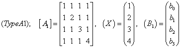
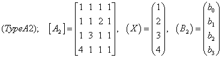
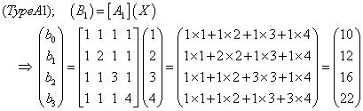
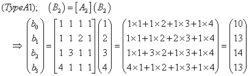
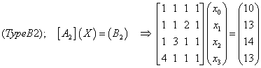
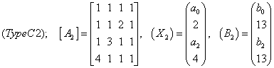
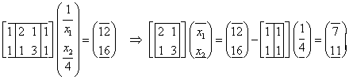

# **Note on class for matrix equation with known/unknown condition** ***行列方程式を解くためのクラス***

## 行列方程式の解法の概説


---

### Type-A: ベクトルXが既知，ベクトルBが未知の場合

ここでは，２つの行列方程式を考えます。






「左辺のベクトル $X$ のすべての要素が既知である」という条件で右辺のベクトル $B$ を求めます。  
ここでは，$A$ と $X$ の内積（ドット積）が $B$ に等しくなります。
具体的には以下のようです。

- Type-A1  


- Type-A2  



---

### Type-B: ベクトルXが未知，ベクトルBが既知の場合

ここでは，２つの行列方程式を考えます。


「右辺のベクトル $B$ のすべての要素が既知である」という条件で左辺のベクトル $X$ を求めます。  
ここでは，「掃き出し法（ガウスの消去法）」を採用します。
他には，「LU分解法」，逆行列を活用する「クラメルの解法」などが知られています。
必要に応じてピボッティング(行の入れ替え)を行いながら，
行基本変形のみを行うことによって $A$ と $B$ を変換して簡略化し，最終的に $X$ を求めます。
行列方程式における３種類の行基本変形とは以下のようです。

> 1. ある行を c 倍する。
> 2. ある行の c 倍を他の行に加える
> 3. ある２つの行を入れ替える

具体的な解法は以下のようです。

- Type-B1  
行列方程式の初期状態は次のようです。


【前方消去，行列の左下を消去する】  
「2 行目に 1行目の-1倍を加える」 「3 行目に 1行目の-1倍を加える」 「4 行目から 1行目の-1倍を加える」  
【後方代入， $A$ を対角行列化する】  
「1 行目に 4行目の-1/3倍を加える」 「1行目に 3行目の-1/2倍を加える」 「1行目に 2行目の-1倍を加える」


【正規化，行列を単位行列化する】  
「3行目を1/2倍する」 「4行目を1/3倍する」


- Type-B2  
行列方程式の初期状態は次のようです。



【前方消去，2行目を処理する】  
「2 行目に 1行目の-1倍を加える」 「3 行目に 1行目の-1倍を加える」 「4 行目に 1行目の-4倍を加える」  
【行の入替え，2行2列目がゼロになるのを避け，2列目で絶対値が最大の4行目と2行目を入れ替える】  
「2行目と4行目を入れ替える」


【前方消去，3行目を処理する】  
「3 行目に 2行目の2/3倍を加える」  
【前方消去，4行目を処理する】  
「4 行目に 3行目の1/2倍を加える」  


【後方代入， $A$ を対角行列化する】  
「3行目に 4行目の-2倍を加える」 「2行目に 4行目の-3/2倍を加える」 「1行目に 4行目を加える」  
「2行目に 3行目の-3/2倍を加える」 「1行目に 3行目の-1/2倍を加える」  
「1行目に 2行目の1/3倍を加える」  
【正規化・行列を単位行列化する】  
「4行目を-1倍する」 「3行目を-1/2倍する」 「2行目を-1/3倍する」


---

### Type-C: ベクトルの一部が既知である場合

左辺のベクトル $X$ と右辺のベクトル $B$ の成分の既知・未知条件が個別に与えら，
ベクトルの一部が既知である場合を考えます。  
計算過程は以下のようになります。

> 【部分行列不定式の誘導】 ベクトル成分の既知・未知条件を考慮して，ベクトル $B$ の成分が既知の行だけを抜き出す
> 【掃き出し法】 掃き出し法によりベクトル $X$ の未知成分を求める
> 【行列とベクトルの内積計算】 ベクトル $B$ の成分が未知の行を利用して，$B$ の未知成分を求める

ここでは，以下の２つの行列方程式を考えます。





「左辺と左辺ののベクトル $X$, $B$ の各要素の一部が既知である」という条件でベクトル $X$ と$B$ を求めます。  
ここでは，Type B と同様に「掃き出し法（ガウスの消去法）」を採用します。

具体的な解法は以下のようです。

- Type-C1  
行列方程式の初期状態は次のようです。


【部分行列方程式，右辺が既知の行だけを取り出す】  
「2行目と3行目を取り出す」
【部分行列方程式，左辺の既知の列を右辺に移項する】  
「1列目と4列目を右辺に移項する」



【掃き出し法】  
「$x_1$ と $x_2$ を求める」 「$b_0$ と $b_3$ を求める」


- Type-C2  
行列方程式の初期状態は次のようです。


【部分行列方程式，右辺が既知の行だけを取り出す】  
「1行目と2行目を取り出す」
【部分行列方程式，左辺の既知の列を右辺に移項する】  
「2列目と4列目を右辺に移項する」


【掃き出し法】  
「$x_0$ と $x_2$ を求める」 「$b_0$ と $b_2$ を求める」


---

## クラスを用いたプログラミング  [gm_matrix_equation_class.py](gm_matrix_equation_class.py)

行列方程式を解くためのクラスについて解説します

### **[section_module]**  拡張モジュール  
```python
print('*** class GMMatrixEq: solving matrix equation ***')
print('    *** with known/unknown condition ***')
# ---------------------------------------------------------
print('### --- section_module: (GMMatrixEq) importing items from module --- ###')
from numpy import (
    ndarray, array, dot, full, ix_, linalg, logical_not as loginot)
import copy
```
クラスが利用する関数を，拡張モジュールnumpyからimportしています。  
また，クラスのインスタンスを複製するために，拡張モジュール copy もimportしています。


### **[section_class]**  クラスの定義と記述
クラスに所属するインスタンス変数とインスタンス関数を定義し，記述しています。  

**[section_ca]**  初期化関数
```python
print('### --- section_class: (GMMatrixEq) describing class --- ###')
class GMMatrixEq():
    ## --- section_ca: (GMMatrixEq) initializing class instance --- ##
    def __init__(self,
            aa: tuple = ((1, 1, 1, 1), (1, 2, 1, 1), (1, 1, 3, 1), (1, 1, 1, 4)),
            xx: tuple = None, bb: tuple = None,
            cndxx: tuple = None, cndbb: tuple = None ) -> None:
        ''' matrix equation; [A] * (X) = (B) '''
        self._aa = None  # matrix [A]: ndarray
        self._xx = None  # left vector (X): ndarray
        self._bb = None  # right vector (B): ndarray
        self._cndxx = None  # known/unknown condition for vector (X): tuple
        self._cndbb = None  # known/unknown condition for vector (B): tuple
        self.set_matrix_eq(aa=aa, xx=xx, bb=bb, cndxx=cndxx, cndbb=cndbb)
```
***初期化関数__init__( ) ::*** この関数はクラスGMMatrixEq型のインスタンスを作成するときに自動的に起動します。
- インスタンス変数は５個あります。
行列方程式を構成するマトリックスとベクトル self._aa: ndarray と self._xx: ndarray, self._bb: ndarray，
および，ベクトル xx と bb の要素の既知・未知条件，self._cndxx と self._cndbb です。
- これらのインスタンス変数すべてをひとまず None で初期化することによって，インスタンス内で宣言しています。
（このことは，文法的には不要ですが，クラスの構成を整理するために初期化しています。）
- 引数は５個すべてをでを Setting関数 set_matrix_eq( ) に渡すことにより，
インスタンス変数を更新します。


**[section_cb]**  Setting関数とGetting関数
```python
    ## --- section_cb: (GMMatrixEq) setting and getting functions --- ##
    ## setting functions
    def set_matrix_eq(self,
            aa: tuple = None, xx: tuple = None, bb: tuple = None,
            cndxx: tuple = None, cndbb: tuple = None) -> None:
        if aa is not None:
            self._aa = array(aa, dtype='float64')
            self._bb = full(len(self._aa), None, dtype='float64')  # preparing default problem
            self._bb = array([sum(aai) for aai in aa], dtype='float64')
            self._cndxx = tuple([False] * len(self._aa))
            self._cndbb = tuple([True] * len(self._aa))
        if xx is not None: self._xx = array(xx, dtype='float64')
        if bb is not None: self._bb = array(bb, dtype='float64')
        if cndxx is not None: self._cndxx = tuple(cndxx)
        if cndbb is not None: self._cndbb = tuple(cndbb)
    ## getting functions
    def aa(self) -> ndarray: return self._aa
    def xx(self) -> ndarray: return self._xx
    def bb(self) -> ndarray: return self._bb
    def cndxx(self) -> tuple: return self._cndxx
    def cndbb(self) -> tuple: return self._cndbb
    def copy(self) -> object:
        return copy.deepcopy(self)
```
***Setting関数 set_matrix_eq( ) ::***  引数を受け取り，インスタンス変数を更新します。  
- 引数 aa は行列方程式におけるマトリックス[M]を受け取ります。
値はリスト構造型（tuple, list または ndarray）でなければなりません。
- 引数 xx は行列方程式における左辺のベクトル(X)を，
引数 bb は行列方程式における右辺のベクトル(B)を受け取ります。
値はリスト構造型でなくてはなりません。
- 引数 cndxx は xx，引数 cndbb は bb における個々の成分の既知・未知条件を受け取ります。
値が True のときはベクトル成分が既知，False のときは未知であることを示します。

引数がデフォルト値 None ではなく，具体的な数値の場合に対応するインスタンス変数が更新されます。
具体的な処理内容は以下のようです。
1. 引数 aa が None でない場合には，self._aa が更新され，darray型に変換されます。 
この時，self._xx, self._bb と self._cndxx，self._cndbb もデフォルトで更新されます。
すなわち aa に対して self._xx が未知，self._bb 既知であるという行列方程式が自動的に設定されます。
self._cndxx のすべての成分が False に，self._cndbb のすべての成分が True になります。
2. 引数 xx が None でない場合には，self._xx が更新され，darray型に変換されます。
3. 引数 bb が None でない場合には，self._bb が更新され，darray型に変換されます。
4. 引数 cndxx が None でない場合には，self._cndxx が更新され，tuple型に変換されます。
5. 引数 cndbb が None でない場合には，self._cndbb が更新され，tuple型に変換されます。
 
***Getting関数 aa( ) ::*** インスタンス変数 self._aa を参照します。  
self._aa の値をndarray型で返します。

***Getting関数 xx( ) ::*** インスタンス変数 self._xx を参照します。  
self._xx の値を参照して ndarray型で返します。

***Getting関数 bb( ) ::*** インスタンス変数 self._bb を参照します。  
self._bb の値を参照して ndarray型で返します。

***Getting関数 xx( ) ::*** インスタンス変数 self._aa を参照します。  
self._aa の値を参照して ndarray型で返します。

***Getting関数 xx( ) ::*** インスタンス変数 self._aa を参照します。  
self._aa の値を参照して ndarray型で返します。

***Getting関数 cndxx( ) ::*** インスタンス変数 self._cndxx を参照します。  
self._cndxx の値を tuple型で返します。

***Getting関数 cndbb( ) ::*** インスタンス変数 self._cndbb を参照します。  
self._cndbb の値を tuple型で返します。

***Getting関数 copy( ) ::*** インスタンスを複製して返します。
拡張モジュール copy が提供する関数 deepcopy( ) を利用してインスタンスを全体を複製して返します。


**[section_cc]**  文字列関数
```python
    ## --- section_cc: (GMMatrixEq) string function for print() --- ##
    def __str__(self) -> str:
        return (
            f'    aa = \n{self._aa}  \n    xx = {self._xx}  \n    bb = {self._bb}\n'
            f'    cndxx = {self._cndxx}\n    cndbb = {self._cndbb}' )
```
文字列関数__str__( ) を記述しています。

***文字列関数 __str__( ) :: *** インスタンスの属性を記述する文字列を作成して返します。  
関数print()でインスタンス名を渡すと起動します，
インスタンスの属性（クラス名とインスタンス変数などを）を記述する文字列をf-string型で作成して返します。


**[section_cd]**  行列方程式の解法
```python
    ## --- section_cd: (GMMatrixEq) solving matrix equation --- ##
    def solve(self) -> None:
        if all(self._cndxx):  ## Type-A; xx is known; finding bb; calculate inner product
            self._bb = dot(self._aa, self._xx)
        elif all(self._cndbb):  ## Type-B; bb is known; finding aa; solving whole matrix equation xx
            self._xx = linalg.solve(self._aa, self._bb)
        else:  ## Type-C; forming and solving partial matrix equation
            aa_wk = self._aa[ix_(self._cndbb, loginot(self._cndxx))]  # forming partial matrix aa
            bb_wk = self._bb[ix_(self._cndbb)]  # forming partial vector bb
            bb_wk -= dot(
                self._aa[ix_(self._cndbb, self._cndxx)],
                self._xx[ix_(self._cndxx)] )
            xx_wk = linalg.solve(aa_wk, bb_wk)  # solving partial matrix equation
            self._xx[loginot(self._cndxx)] = xx_wk
            self._bb[loginot(self._cndbb)] = dot(
                self._aa[ix_(loginot(self._cndbb))], self._xx)
```

***関数 solve( ) ::*** 行列方程式をといて，ベクトルの未定成分を求めます。
ベクトルの未定成分の配置によって，票列方程式の解法は以下の３つのタイプに分かれます。
解法の詳細はこの解説の前半で詳しく説明しています。

[Type-A]  ベクトル(X)が既知で，ベクトル(B)が未知であるタイプ
これは self._cndxx のすべての成分が True，self._cndbb のすべての成分が False のときに対応する。
マトリックス(A)とベクトル(X)の内積を計算することにより，ベクトル(B)を求める。


[Type-B]  ベクトル(X)が未知で，ベクトル(B)が既知であるタイプ
これは self._cndxx のすべての成分が False，self._cndbb のすべての成分が True のときに対応する。
「掃き出し法（ガウスの消去法）」により，必要に応じてピボッティング(行の入れ替え)を行いながら，
[A]と(B)を変換して簡略化し，最終的に(X)を求めます。

[Type-C]  上記２タイプ以外で，ベクトル(X)とベクトル(B)の成分の一部が未知であるタイプ
これは self._cndxx の成分と，self._cndbb の成分の一部が True のときに対応する。
1. 【部分行列不定式の誘導】 ベクトル成分の既知・未知条件を考慮して，(B)の成分が既知の行だけを抜き出す  
2. 【掃き出し法】 掃き出し法によりベクトル(X)の未知成分を求める  
3. 【行列とベクトルの内積計算】 ベクトル(B)の成分が未知の行を利用して，(B) の未知成分を求める  


