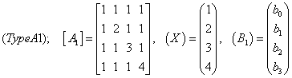
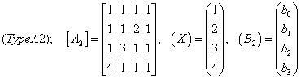
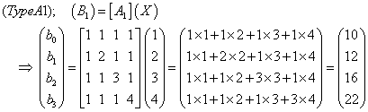
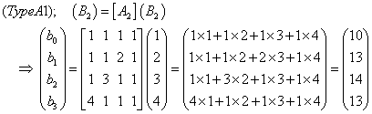

# **Note on matrix equation: Type A; vector $X$ is given**

## 行列方程式の解法
ここでは，右辺のベクトル $B$ が未知である，２つの行列方程式を考えます。






「左辺のベクトル $X$ のすべての要素が既知である」という条件で右辺のベクトル $B$ を求めます。  
ここでは，$A$ と $X$ の内積（ドット積）が $B$ に等しくなります。
具体的には以下のようです。

- Type-A1  


- Type-A2  



---

## プログラミング演習

この演習では，以下に示すでは３つの方針で作成するプログラムを紹介して解説します。

> [gm_matrix_equation_a0_bb_list.py](gm_matrix_equation_a0_bb_list.py)  
> リスト構造（listとtuple）を用いて行列方程式を記述します。
> for-loopを活用したドット積の計算によりベクトル $B$ を求めます。
> 
> [gm_matrix_equation_a1_bb_array.py](gm_matrix_equation_a1_bb_array.py)  
> 拡張モジュールnumpyが提供するndarrayを用いて行列方程式を記述し，
> for-loopを活用したドット積の計算によりベクトル $B$ を求めます。
> リスト構造を用いる場合と比較して，計算過程を簡潔にできます。
> 
> [gm_matrix_equation_a2_bb_array_func.py](gm_matrix_equation_a2_bb_array_func.py)  
> ndarrayを用いて行列方程式を記述し，ドット積の計算によりベクトル $B$ を求めます。
> nyupyが提供するマトリックスとベクトルのドット積を計算するための関数を活用することにより，
> プログラムの記述を簡略にしています。
> 

---

### [gm_matrix_equation_a0_bb_list.py](gm_matrix_equation_a0_bb_list.py)

### **[section_setting]**
マトリックス $aa$と，左辺ベクトル $xx$，右辺ベクトル $bb$ をlistで記述します。
```python
print('*** Matrix Equation with list: aa * xx = bb; xx is given ***')

# =========================================================
print('### --- section_setting --- ###')
aa1 = [ [1, 1, 1, 1], [1, 2, 1, 1],
        [1, 1, 3, 1], [1, 1, 1, 4] ]
aa2 = [ [1, 1, 1, 1], [1, 1, 2, 1],
        [1, 3, 1, 1], [4, 1, 1, 1] ]
xx = [1, 2, 3, 4]
bb = (None, None, None, None)
aa = aa1
rank = len(bb)
```
２つのマトリックスを用意することによって２種類の行列方程式を扱います。
マトリックスの切り替えは， aa = aa1 の記述を変更することによって可能です。

### **[section_solving]**
マトリックス $aa$ とベクトル $xx$ の積（ドット積）を２重for-loopで計算しています。
```python
print('### --- section_solving --- ###')
for i in range(rank):
    bb[i] = 0
    for j in range(rank):
        bb[i] += aa[i][j] * xx[j]
print(f'{aa = }\n{xx = }\n{bb = }')
```
最初のfor-loopは行に，次のfor-loopは列に対応しています。
bb[i]の値をゼロで初期化した後に，aa[i][j]とxx[j]の積を加算します。

---

### [gm_matrix_equation_a1_bb_array.py](gm_matrix_equation_a1_bb_array.py)

### **[section_setting]**
マトリックス $aa$ と左辺ベクトル $xx$ ，右辺ベクトル $bb$ をndarrayで記述します。
```python
print('### --- section_module: importing items from module --- ###')
from numpy import array

# =========================================================
print('### --- section_setting --- ###')
aa1 = ( (1, 1, 1, 1), (1, 2, 1, 1),
        (1, 1, 3, 1), (1, 1, 1, 4) )
aa2 = ( (1, 1, 1, 1), (1, 1, 2, 1),
        (1, 3, 1, 1), (4, 1, 1, 1) )
xx = (1, 2, 3, 4)
bb = (None, None, None, None)

aa = array(aa1, dtype='float64')
xx = array(xx, dtype='float64')
bb = array(bb, dtype='float64')
```
関数array()はlistやtupleをndarrayへ変換します。

### **[section_solving]**
マトリックス $aa$ とベクトル $xx$ の積（ドット積）を計算しています。
```python
print('### --- section_solving --- ###')
for i, aai in enumerate(aa):
    bb[i] = sum(aai * xx)
print(f'{aa = }\n{xx = }\n{bb = }')
```
リスト構造を用いた前のプログラムでは２重for-loopが必要であったのに対して，
このプログラムはではndarray同士の積とその総和を計算する関数sum()を用いることによって，
単純なfor-loopとなっています。

以下には，ndarrayに関する演算の例を示しています。
```python
a, b = array([1, 2, 3]), array([-2, 2, 4])  # ndarray
print(a + 2)
# [3 4 5]
print(a * 2)
# [2 4 6]
print(a ** 2)
# [1 4 9]
print(a + b)
# [-1  4  7]
print(a * b)
# [-2  4 12]
print(abs(b))
# [2 2 4]
```
ndarrayと数値変数の演算では，数値変数がndarrayのすべての要素に作用します。
また，darray同士の演算（要素数が同じである必要がある）では，対応する各要同士で演算が行われます。

---

### [gm_matrix_equation_a2_bb_array_func.py](gm_matrix_equation_a2_bb_array_func.py)

### **[section_setting]**
前のプログラムと同様に，行列方程式をndarrayで記述しています。
```python
print('### --- section_module: importing items from module --- ###')
from numpy import (array, dot)

# =========================================================
print('### --- section_setting --- ###')
aa1 = ( (1, 1, 1, 1), (1, 2, 1, 1),
        (1, 1, 3, 1), (1, 1, 1, 4) )
aa2 = ( (1, 1, 1, 1), (1, 1, 2, 1),
        (1, 3, 1, 1), (4, 1, 1, 1) )
xx = (1, 2, 3, 4)
bb = (None, None, None, None)

aa = array(aa1, dtype='float64')
xx = array(xx, dtype='float64')
bb = array(bb, dtype='float64')
```
関数array()はlistとtupleをndarrayへ変換します。

### **[section_solving]**
マトリックス $aa$ とベクトル $xx$ の積（ドット積）を計算しています。
```python
print('### --- section_solving --- ###')
bb = dot(aa, xx)
print(f'{aa = }\n{xx = }\n{bb = }')
```
ドット積を計算するのに，numpyが提供する関数dot()を用います。


