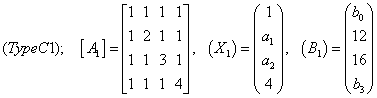
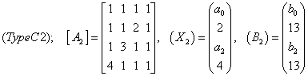
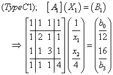
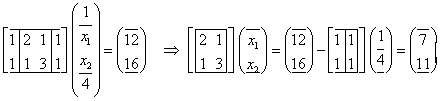
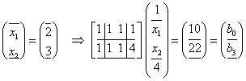
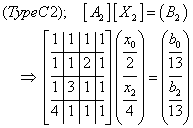
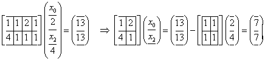
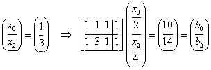

# **Note on matrix equation: Type C; known/unknown condition is given**

## 行列方程式の解法
左辺のベクトル $X$ と右辺のベクトル $B$ の成分の既知・未知条件が個別に与えられている場合を考えます。
計算過程は以下のようになります。

> 【部分行列不定式の誘導】 ベクトル成分の既知・未知条件を考慮して，ベクトル $B$ の成分が既知の行だけを抜き出す  
> 【掃き出し法】 掃き出し法によりベクトル $X$ の未知成分を求める  
> 【行列とベクトルの内積計算】 ベクトル $B$ の成分が未知の行を利用して，$B$ の未知成分を求める  

ここでは，以下の２つの行列方程式を考えます。






「左辺と左辺ののベクトル $X$, $B$ の各要素の一部が既知である」という条件でベクトル $X$ と$B$ を求めます。  
ここでは，Type B と同様に「掃き出し法（ガウスの消去法）」を採用します。

具体的な解法は以下のようです。

- Type-C1  
行列方程式の初期状態は次のようです。



【部分行列方程式，右辺が既知の行だけを取り出す】  
「2行目と3行目を取り出す」  
【部分行列方程式，左辺の既知の列を右辺に移項する】  
「1列目と4列目を右辺に移項する」



【掃き出し法】  
「$x_1$ と $x_2$ を求める」 「$b_0$ と $b_3$ を求める」



- Type-C2  
行列方程式の初期状態は次のようです。



【部分行列方程式，右辺が既知の行だけを取り出す】  
「1行目と2行目を取り出す」
【部分行列方程式，左辺の既知の列を右辺に移項する】  
「2列目と4列目を右辺に移項する」



【掃き出し法】  
「$x_0$ と $x_2$ を求める」 「$b_0$ と $b_2$ を求める」




---

## プログラミング演習

この演習では，以下に示すでは３つの方針で作成するプログラムを紹介して解説します。

> [gm_matrix_equation_c0_fixity_list.py](gm_matrix_equation_c0_fixity_list.py)  
> リスト構造（listとtuple）を用いて行列方程式を記述します。
> ベクトルの既知・未知条件に対応して部分行列方程式を誘導し，
> 「掃き出し法」により $X$ を求め，次いで $B$ を求めます。
> 
> [gm_matrix_equation_c1_fixity_array.py](gm_matrix_equation_c1_fixity_array.py)  
> 拡張モジュールnumpyが提供するndarrayを用いて行列方程式を記述します。
> 部分行列方程式を誘導して，「掃き出し法」により $X$ と $B$ を求めます。
> リスト構造を用いる場合と比較して，計算過程を簡潔にできます。
> 
> [gm_matrix_equation_c2_fixity_array_func.py](gm_matrix_equation_c2_fixity_array_func.py)  
> ndarrayを用いて行列方程式を記述します。
> 誘導した部分行列方程式からベクトル $X$ を求め，次いで $B$ を求めます。
> nyupyが提供する行列方程式を解くための関数を活用することにより，
> プログラムの記述を簡略にしています。
> 

---

### [gm_matrix_equation_c0_fixity_list.py](gm_matrix_equation_c0_fixity_list.py)

### **[section_setting]**  マトリックス方程式の設定
マトリックス $aa$と，左辺ベクトル $xx$，右辺ベクトル $bb$ をlistで記述します。
```python
print('\n*** Matrix Equation with list: aa * xx = bb; solve with fixity ***')
# ---------------------------------------------------------

# =========================================================
print('### --- section_setting --- ###')
aa1 = [ [1, 1, 1, 1], [1, 2, 1, 1],
        [1, 1, 3, 1], [1, 1, 1, 4] ]
xx1 = [1, None, None, 4]
bb1 = [None, 12, 16, None]
cnd_xx1 = (True, False, False, True)
cnd_bb1 = (False, True, True, False)
aa2 = [ [1, 1, 1, 1], [1, 1, 2, 1],
        [1, 3, 1, 1], [4, 1, 1, 1] ]
xx2 = [None, 2, None, 4]
bb2 = [None, 13, None, 13]
cnd_bb2 = (False, True, False, True)
cnd_xx2 = (False, True, False, True)

aa = aa1
xx = xx1
bb = bb1
cnd_xx = cnd_xx1
cnd_bb = cnd_bb1
rank = len(bb)
```
マトリックスとベクトルを個別に用意することによって，２種類の行列方程式を扱います。
knwn_xx と knwn_bb は $XX$ と $bb$ の既知・未知条件のリストです。
マトリックスの切り替えは， aa = aa1 の記述を変更することによって可能です。

### **[section_solving]**  マトリックス方程式の解法
ベクトルの既知・未知条件を考慮して部分行列方程式を誘導します。
「掃き出し法」によりベクトルの未知成分を求めます。
```python
print('### --- section_solving --- ###')
# setting partial matrix equation
aa_wk, bb_wk = [], []
for i in range(rank):
    if cnd_bb[i]:
        aai = []
        for j in range(rank):
            if not cnd_xx[j]: aai.append(aa[i][j])
        aa_wk.append(aai)
        bbi = bb[i]
        for j in range(rank):
            if cnd_xx[j]: bbi -= aa[i][j] * xx[j]
        bb_wk.append(bbi)
rank_wk = len(bb_wk)
#  Gaussian elimination method
## forward elimination with pivoting
for i in range(rank_wk):
    for j in range(i+1,rank_wk):  # pivoting partial
        if abs(aa_wk[i][i]) < abs(aa_wk[j][i]):
            for k in range(i,rank_wk):
                aa_wk[i][k], aa_wk[j][k] = aa_wk[j][k], aa_wk[i][k]
            bb_wk[i], bb_wk[j] = bb_wk[j], bb_wk[i]
    for j in range(i+1,rank_wk):  # eliminating
        ratio = aa_wk[j][i] / aa_wk[i][i]
        for k in range(i,rank_wk):
            aa_wk[j][k] -= aa_wk[i][k] * ratio
        bb_wk[j] -= bb_wk[i] * ratio
## backward substitution
for i in range(rank_wk-1,-1,-1):
    for j in range(i-1,-1,-1):
        ratio = aa_wk[j][i] / aa_wk[i][i]
        for k in range(i,rank_wk):
            aa_wk[j][k] -= aa_wk[i][k] * ratio
        bb_wk[j] -= bb_wk[i] * ratio
## normalization
xx_wk = []
for i in range(rank_wk):
    xx_wk.append(bb_wk[i] / aa_wk[i][i])
## calculating vectors
jj = 0
for j in range(rank):
    if not cnd_xx[j]:
        xx[j] = xx_wk[jj]
        jj += 1
for i in range(rank):
    bb[i] = 0
    for j in range(rank):
        bb[i] += aa[i][j] * xx[j]
print(f'{aa = }\n{xx = }\n{bb = }\n{cnd_xx = }\n{cnd_bb = }')
```
部分行列方程式を誘導し，「掃き出し法」により部分行列方程式を処理し，
$xx$ 次いで $bb$ を求めます。

---

### [gm_matrix_equation_c1_fixity_array.py](gm_matrix_equation_c1_fixity_array.py)

### **[section_setting]**  マトリックス方程式の設定
マトリックス $aa$ と左辺ベクトル $xx$ ，右辺ベクトル $bb$ をndarrayで記述します。
```python
print('\n*** Matrix Equation with array: aa * xx = bb; solve with fixity ***')
# ---------------------------------------------------------
## --- importing item from module ---
from numpy import (array, diag)
import copy

# =========================================================
print('### --- section_setting --- ###')
aa1 = ( (1, 1, 1, 1), (1, 2, 1, 1),
        (1, 1, 3, 1), (1, 1, 1, 4) )
bb1 = (None, 12, 16, None)
xx1 = (1, None, None, 4)
cnd_bb1 = (False, True, True, False)
cnd_xx1 = (True, False, False, True)
aa2 = ( (1, 1, 1, 1), (1, 1, 2, 1),
        (1, 3, 1, 1), (4, 1, 1, 1) )
bb2 = (None, 13, None, 13)
xx2 = (None, 2, None, 4)
cnd_bb2 = (False, True, False, True)
cnd_xx2 = (False, True, False, True)

aa = array(aa1, dtype='float64')
xx = array(xx1, dtype='float64')
bb = array(bb1, dtype='float64')
cnd_xx = cnd_xx1
cnd_bb = cnd_bb1
```
関数array()はlistやtupleをndarrayへ変換します。
ただし，ベクトルの既知・未知条件はtupleのままです。

### **[section_solving]**  マトリックス方程式の解法
ベクトルの既知・未知条件を考慮して部分行列方程式を誘導します。
「掃き出し法」によりベクトル $X$ を求め，次いで ベクトル $B$ を求めます。
```python
print('### --- section_solving --- ###')
# setting partial matrix equation
bb_knwn, bb_uknwn = [], []
for i, cnd_bbi in enumerate(cnd_bb):
    if cnd_bbi: bb_knwn.append(i)
    else: bb_uknwn.append(i)
xx_knwn, xx_uknwn = [], []
for i, cnd_xxi in enumerate(cnd_xx):
    if cnd_xxi: xx_knwn.append(i)
    else: xx_uknwn.append(i)
aa_wk, bb_wk = [], []
for aai, bbi in zip(aa[bb_knwn, :], bb[bb_knwn]):
    aa_wk.append(aai[xx_uknwn])
    bb_wk.append(bbi - sum(aai[xx_knwn] * xx[xx_knwn]))
aa_wk, bb_wk = array(aa_wk), array(bb_wk)
rank_wk = len(bb_wk)
#  Gaussian elimination method
## forward elimination with pivoting
for i in range(rank_wk):
    for j in range(i+1,rank_wk):  # pivotting in line
        if abs(aa_wk[i,i]) < abs(aa_wk[j,i]):
            aa_wk[i,i:], aa_wk[j,i:] = aa_wk[j,i:], copy.copy(aa_wk[i,i:])
            bb_wk[i], bb_wk[j] = bb_wk[j], bb_wk[i]
    for j in range(i+1,rank_wk):
        ratio = aa_wk[j,i] / aa_wk[i,i]
        aa_wk[j,i:] -= aa_wk[i,i:] * ratio
        bb_wk[j] -= bb_wk[i] * ratio
## backward substitution
for i in range(rank_wk-1,-1,-1):
    for j in range(i-1,-1,-1):
        ratio = aa_wk[j,i] / aa_wk[i,i]
        aa_wk[j,i:] -= aa_wk[i,i:] * ratio
        bb_wk[j] -= bb_wk[i] * ratio
## normalization
xx_wk = bb_wk / diag(aa_wk)
## calculating vectors
jj = 0
for j, xx_uknwnj in enumerate(xx_uknwn):
    xx[xx_uknwnj] = xx_wk[j]
for i, aai in enumerate(aa):
    bb[i] = sum(aai * xx)
print(f'{aa = }\n{xx = }\n{bb = }\n{cnd_xx = }\n{cnd_bb = }')
```
前のプログラムと同様に，部分行列方程式を誘導してベクトルの未知成分を求め。
ndarrayの計算機能を生かし，
listを用いる場合と比べてプログラムをより簡潔に記述できます。

---

### [gm_matrix_equation_c2_fixity_array_func.py](gm_matrix_equation_c2_fixity_array_func.py)

### **[section_setting]**  マトリックス方程式の設定
前のプログラムと同様に，行列方程式をndarrayで記述しています。
```python
print('\n*** Matrix Equation with array func: aa * xx = bb; solve with fixity ***')
# ---------------------------------------------------------
## --- importing item from module ---
from numpy import (array, dot, ix_, linalg, logical_not as loginot)

# =========================================================
print('### --- section_setting --- ###')
aa1 = ( (1, 1, 1, 1), (1, 2, 1, 1),
        (1, 1, 3, 1), (1, 1, 1, 4) )
xx1 = (1, None, None, 4)
bb1 = (None, 12, 16, None)
cnd_xx1 = (True, False, False, True)
cnd_bb1 = (False, True, True, False)
aa2 = ( (1, 1, 1, 1), (1, 1, 2, 1),
        (1, 3, 1, 1), (4, 1, 1, 1) )
xx2 = (None, 2, None, 4)
bb2 = (None, 13, None, 13)
cnd_xx2 = (False, True, False, True)
cnd_bb2 = (False, True, False, True)

aa = array(aa1, dtype='float64')
xx = array(xx1, dtype='float64')
bb = array(bb1, dtype='float64')
cnd_xx = cnd_xx1
cnd_bb = cnd_bb1
```
関数array()はlistとtupleをndarrayへ変換します。

### **[section_solving]**  マトリックス方程式の解法
部分行列方程式を誘導し，「掃き出し法」によりベクトルを求めています。
```python
print('### --- section_solving --- ###')
#  setting partial matrix equation
aa_wk = aa[ix_(cnd_bb,loginot(cnd_xx))]
bb_wk = bb[ix_(cnd_bb)] - dot(aa[ix_(cnd_bb,cnd_xx)], xx[ix_(cnd_xx)])
#  Gaussian elimination method
xx_wk = linalg.solve(aa_wk, bb_wk)  # solving matrix equation
xx[ix_(loginot(cnd_xx))] = xx_wk
## calculating vectors
bb = dot(aa, xx)
print(f'{aa = }\n{xx = }\n{bb = }\n{cnd_xx = }\n{cnd_bb = }')
```
関数ix_()を活用して，部分行列方程式を誘導します。
行列方程式を解くのに，numpyが提供する関数linalg.solve()を用います。


